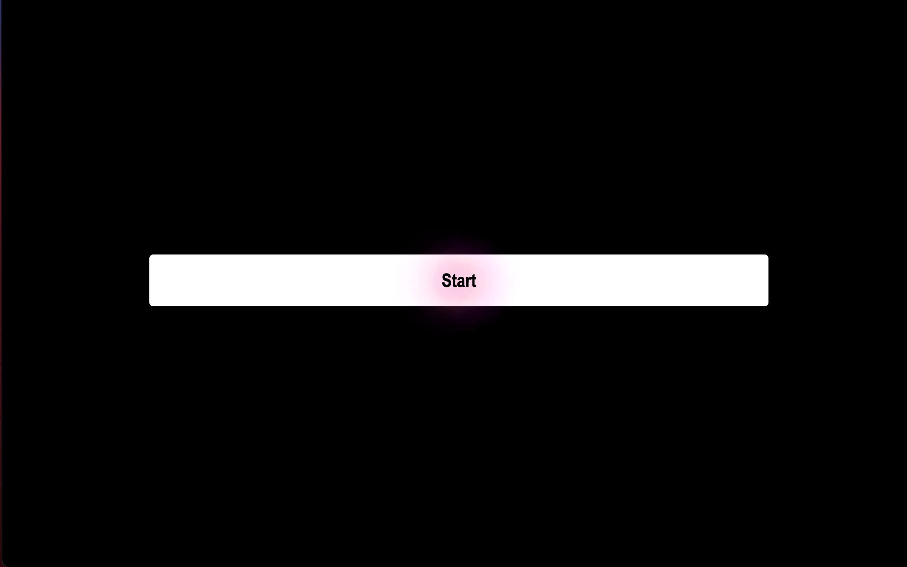

 In this assignment I was challenged to create a Code Quiz using HTML, CSS, and Javascript. The Code Quiz was challenging due to myself not fully grasping how to display my High Scores on my last page. I plan on going back to this code to improve and add more features. What I learned is that I need to focus more on Javascript and learning more about for loops.

 [Link to deployed Webpage](https://temifemi.github.io/CodeQuiz/)

 ## Screenshot of Portfolio Website
 